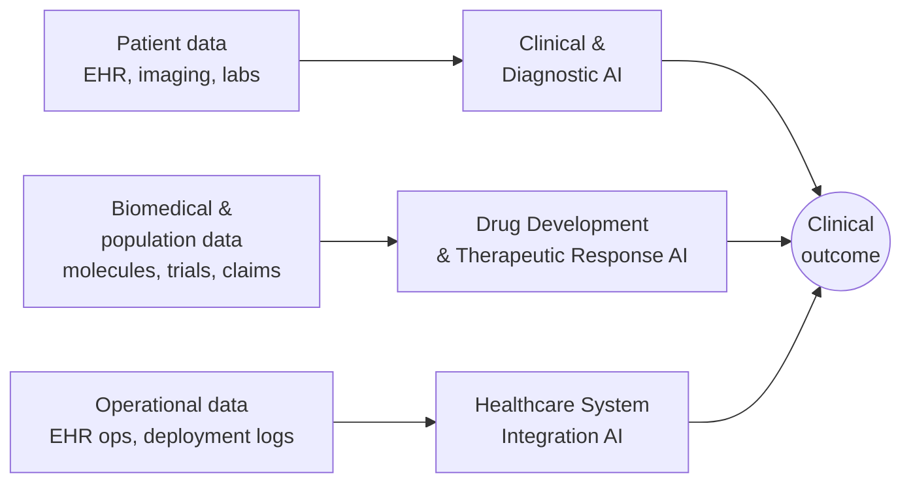

# Healthcare AI Landscape Survey

## Purpose

This document maps the current healthcare AI landscape across three sub-domains, to orient subsequent prototype exploration for the 1.001 class project. The goal is to understand where AI is actively applied in healthcare today, what data sources drive each area, and what architectural patterns recur across them.

## Scope

Three sub-domains cover the majority of applied healthcare AI:

1. **Clinical and diagnostic AI** — AI assisting clinicians at the point of diagnosis, treatment planning, and risk assessment.
2. **AI in drug development and therapeutic response** — AI across the drug lifecycle: discovery, repurposing, trials, and population-level response analysis.
3. **AI for healthcare system integration** — AI at the operational and deployment layer: reaching real practice, integrating with EHRs, and being monitored in production.

## Sub-domain 1 — Clinical and Diagnostic AI

AI systems embedded near the clinician workflow synthesize heterogeneous patient data — structured EHR fields, unstructured notes, imaging, laboratory values, waveforms — into suggestions that augment decision-making. The landscape has expanded sharply: as of mid-2024, the U.S. FDA's database listed nearly 900 AI/ML-enabled medical devices, concentrated in radiology, cardiology, and neurology, with steady growth across pathology, ophthalmology, and primary care contexts [1].

Recent multimodal architectures fuse images, text, audio, and sensor streams into unified representations; market analyses project the multimodal medical AI segment growing at a 30%+ CAGR through the early 2030s [2]. In fielded deployments, the primary tasks observed are diagnosis support, treatment recommendation, and complication prediction, with secondary objectives of reducing physician workload and containing cost [3].

Two cross-cutting themes define this sub-domain:

- **Trust and explainability.** The field has converged on XAI layers — SHAP, LIME, Grad-CAM — as a current baseline for interpretability, reflecting both regulatory pressure and clinician demand for auditable rationales [4].
- **Integration into clinical workflow.** Research on adoption consistently shows that an AI tool's value is determined less by raw model accuracy than by how it embeds into existing clinical routines. Interface design, latency, and alert fatigue dominate adoption outcomes [5].

## Sub-domain 2 — AI in Drug Development and Therapeutic Response

AI in the drug lifecycle spans target identification, molecular design, trial recruitment, post-approval monitoring, and population-level response analysis. Earlier work focused on pre-clinical stages — structure-activity modeling, de novo molecular generation — while more recent work extends into regulatory-facing roles and real-world evidence.

The FDA's Center for Drug Evaluation and Research has reported over 500 drug submissions containing AI components between 2016 and 2023, with an accelerating trajectory. In 2024 the agency established the CDER AI Council to consolidate oversight across the drug lifecycle, and in early 2025 issued draft guidance on using AI to support regulatory decision-making for drugs and biologics [6].

Representative milestones include:

- In January 2024 the FDA's ISTAND program accepted its first AI-powered drug development tool — an AI-generated clinical outcome assessment from Deliberate AI that uses multimodal behavioral signal processing for severity grading in anxiety and depression [7].
- Large-scale drug repurposing studies have screened thousands of approved medicines against thousands of indications to surface repositioning candidates, including for rare and under-served conditions [8].

Within this sub-domain sits a practical research thread distinct from de novo discovery: using observational clinical data — EHRs, claims, registries — to characterize how approved therapeutics perform across patient subpopulations (pharmacoepidemiology / real-world evidence). This thread is closer to population-scale response analysis than to molecular design.

## Sub-domain 3 — AI for Healthcare System Integration

Downstream of discovery and bedside decisions lies the system layer, where models are deployed, monitored, and maintained inside hospital and pharmacy operations. AI applications here cluster around three problem families: demand and inventory forecasting, dispensing accuracy and safety, and workflow-embedded clinical decision support [9].

Deployed AI-assisted pharmacy systems in hospital settings have reported substantial reductions in medication distribution errors and stock-out rates, translating directly into patient safety and continuity of care [10]. At the point of dispensing, decision support for drug-drug interactions, dose range checking, and alternative therapy suggestions is an active integration area; LLM-based interfaces are now being tested for interaction detection and therapy substitution.

A broader and less settled question in this sub-domain is the research-to-practice gap: many models validated in controlled or single-center environments face generalizability challenges when scaled across different operational contexts, prompting a wave of interest in deployment frameworks, post-market monitoring, and explicit trust engineering.

## Common Threads Across the Three Sub-domains

Three architectural commitments recur in every sub-domain, in different forms:

- **Integration of heterogeneous data.** Each sub-domain merges data from multiple modalities and sources into a single model or decision surface.
- **Support for decisions made by humans.** The dominant posture is AI-as-assistant to clinicians, scientists, or pharmacists, rather than AI-as-replacement.
- **Real-world deployment tension.** All three grapple with the gap between controlled validation and the messier environments where AI is expected to operate.

These threads will reappear as subsequent documents narrow from this landscape to concrete prototype directions.

## References

1. Jin et al., "How AI is used in FDA-authorized medical devices: a taxonomy across 1,016 authorizations," *npj Digital Medicine*, 2025.
2. Ardic & Dinc, "Emerging trends in multi-modal artificial intelligence for clinical decision support: A narrative review," 2025.
3. "Artificial-Intelligence-Based Clinical Decision Support Systems in Primary Care: A Scoping Review of Current Clinical Implementations," *MDPI*, 2024.
4. "Explainable AI in Clinical Decision Support Systems: A Meta-Analysis of Methods, Applications, and Usability Challenges," PMC, 2024.
5. "Improving AI-Based Clinical Decision Support Systems and Their Integration Into Care From the Perspective of Experts," *JMIR Medical Informatics*, 2025.
6. U.S. Food and Drug Administration, "Artificial Intelligence for Drug Development," CDER.
7. FierceBiotech, "FDA accepts first AI algorithm to drug development tool pilot," 2024.
8. ScienceDaily, "Researchers harness AI to repurpose existing drugs for treatment of rare diseases," September 2024.
9. Alqahtani et al., "Artificial intelligence in clinical pharmacy — A systematic review of current scenario and future perspectives," 2025.
10. "Clinical and Operational Applications of Artificial Intelligence and Machine Learning in Pharmacy: A Narrative Review of Real-World Applications," PMC, 2024.
