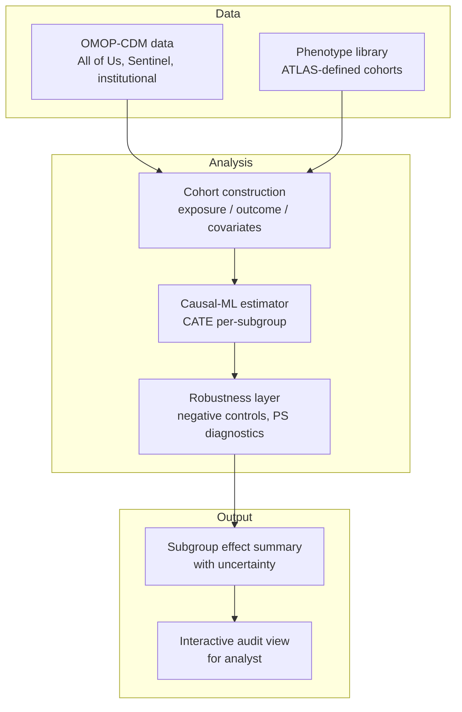

# Prototype P1 — Population-Scale Drug Response Analytics

## Problem Statement

Approved therapeutics rarely produce a uniform response across a patient population. Differences in age, comorbidity profile, concurrent medications, social determinants, and genetic background translate into substantial variation in benefit and risk. When this response heterogeneity is hidden inside a one-number "average effect", decisions about who benefits most — and who is at increased risk — become guesswork.

The prototype explores whether large observational clinical datasets, coupled with modern causal machine learning, can surface response heterogeneity at a resolution useful for population-scale therapeutic decisions.

## Motivation

Three forces make this an attractive direction:

1. **Data availability.** Standardized observational datasets have matured. The OMOP Common Data Model now underpins large distributed networks (OHDSI, Sentinel) that harmonize disparate EHRs into a query-compatible schema [1]. The NIH All of Us Research Program, accessible via a controlled public portal, exposes structured participant data at a scale previously unavailable to outside researchers.
2. **Methodological progress.** Causal machine learning — doubly robust estimation, causal forests, meta-learners, targeted maximum likelihood — has matured to the point where subgroup-level treatment effect estimation is tractable from observational data, with explicit handling of confounding [2][3].
3. **Public-health relevance.** Rapid response to emerging clinical situations — new indications, newly recognized populations at risk, repurposing candidates — increasingly depends on analyzing deployed therapies in the real world rather than waiting for the next trial cohort [4].

## Proposed Approach

The prototype is a pipeline design, not an implementation. It composes three layers:

**Layer A — Cohort construction from harmonized observational data.** Start from an OMOP-compatible dataset. Define cohorts by exposure (a specific therapeutic), outcome (clinical event of interest within a window), and covariates (demographics, comorbidities, concurrent drugs). Cohorts inherit all confounding baked into the observational data; the next layer addresses this.

**Layer B — Causal effect estimation with heterogeneity.** Apply a causal-ML estimator (e.g., a causal forest or X-learner) to estimate the conditional average treatment effect (CATE) conditional on patient covariates. The output is a per-subgroup (or, in principle, per-patient) effect estimate with uncertainty. Robustness checks follow standard pharmacoepidemiology practice: negative-control outcomes, propensity score overlap audits, and sensitivity analyses against unmeasured confounding [5].

**Layer C — Interpretability and presentation.** Summarize CATE by clinically meaningful strata (age bands, comorbidity clusters, concurrent-medication groups). Surface uncertainty explicitly — which subgroups have enough support to report on, and which are under-powered. Deliver the summary in a format that a pharmacoepidemiologist, pharmacist, or public-health analyst can interrogate.

## Data & Infrastructure Requirements

- **Cohort data.** Access to OMOP-CDM-conformed observational data at scale. Options include All of Us (portal-gated), Synthea (fully synthetic, for schema testing), or institutionally-held CDM instances. PHI-containing sources require IRB and data use agreements.
- **Compute.** Federated-compatible frameworks are preferable, because the largest useful datasets are distributed and cannot be moved. OHDSI has a mature federated query infrastructure.
- **Methods stack.** Python + `econml` / `causalml` / `DoWhy` for causal-ML; R + `tlverse` is an alternative. Phenotype definition and cohort construction typically happen via OMOP-native tools (ATLAS).
- **Validation infrastructure.** Negative control outcomes, propensity score diagnostics, benchmark reference cohorts.

## Prototype Architecture Sketch

## Viability Considerations

This prototype would require:

- **Data access work.** Gated datasets (All of Us, institutional CDMs) require formal application processes measured in months. Public synthetic datasets are available for proof-of-concept but do not carry the signal needed for real claims.
- **Domain collaboration.** Pharmacoepidemiology, biostatistics, and clinical-informatics expertise are all needed to define cohorts well and validate causal assumptions.
- **Methodological care.** Causal ML over observational data has well-documented failure modes (unmeasured confounding, positivity violations, specification errors); any serious implementation invests heavily in robustness checking.
- **Effort profile.** A credible end-to-end instance would likely require a multi-person team over many months, with formal data governance layered over the technical work.

## Open Questions

- What is the minimum cohort size at which subgroup-level CATE estimates become actionable rather than speculative?
- How should uncertainty be communicated to an analyst who is not a causal-inference specialist?
- In which deployment posture — behind an analyst dashboard, behind a regulatory submission, behind a public-health alert — does this kind of system actually reach a real decision?

## References

1. Overhage et al., "Observational Medical Outcomes Partnership Common Data Model," widely adopted within OHDSI and FDA Sentinel networks.
2. Sanchez et al., "Causal machine learning for healthcare and precision medicine," *Royal Society Open Science*, 2022.
3. "Causal machine learning for predicting treatment outcomes," *Nature Medicine* / PubMed, 2024.
4. "Real-World Data and Causal Machine Learning to Enhance Drug Development," PMC, 2024.
5. "Machine Learning in Causal Inference: Application in Pharmacovigilance," *Drug Safety* (Springer), 2022.
