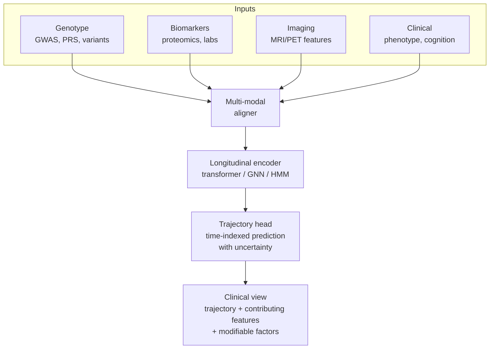

# Prototype P2 — Individualized Longitudinal Risk Modeling AI

## Problem Statement

Clinical risk, today, is typically summarized at a point in time: a risk score for the next five or ten years, updated when the patient returns. Rich longitudinal signal — genotype, repeated biomarkers, imaging, clinical events — is collapsed into coarse snapshots. For progressive conditions, particularly neurodegenerative disease, this framing loses exactly what decision-makers most want: *how* a patient's risk is evolving, and *what* the window for meaningful intervention looks like.

The prototype explores whether multi-modal AI, trained on longitudinal cohort data, can produce per-patient risk *trajectories* that fit into clinical decision workflows.

## Motivation

- **Multi-modal integration is now tractable.** Recent surveys show that AI-optimized polygenic risk scoring, combined with proteomics, imaging, and clinical risk factors, lifts predictive performance meaningfully (e.g., from AUC ~0.64 with conventional PRS to ~0.80 with AI-optimized integrated models in specific cardiology applications [1]).
- **Large longitudinal biobanks exist and are usable.** ADNI (Alzheimer's Disease Neuroimaging Initiative) remains a primary substrate for longitudinal AI modeling in neurodegenerative disease; UK Biobank contributes complementary population-scale multi-omics depth [2][3].
- **Clinical appetite.** Precision medicine's operational bottleneck is not the molecular data; it is producing a risk picture a clinician can act on. Individual, trajectory-aware risk output is closer to the actionable than a single population-level score.

## Proposed Approach

Again, a design-level pipeline. Four layers:

**Layer A — Multi-modal feature assembly.** Align per-patient records across modalities: genotype (genome-wide array, polygenic scores, variant calls), biomarkers (proteomics, metabolomics, labs), imaging (MRI / PET features or embeddings), and clinical phenotype (diagnosis codes, cognitive scores). Harmonize timestamps.

**Layer B — Longitudinal encoder.** A sequence model consuming the aligned modalities per patient at each observation point. Candidate architectures include transformer-style encoders over time-stamped tokens, temporal graph neural networks for variables with known relational structure, or hidden-Markov-family models for interpretable stage inference. Prior work on ADNI has used personalized HMMs to identify disease-related states differentiated by demographics, APOE4 genotype, cognitive scores, and brain-atrophy patterns [4].

**Layer C — Trajectory head.** Output per-patient predicted trajectories of the target quantity (e.g., probability of conversion to MCI or AD within specified windows; or estimated time-to-event) with calibrated uncertainty bands. Cross-validate on held-out subjects and, where possible, externally across cohorts [5].

**Layer D — Clinical presentation.** Translate trajectories into a clinician-facing view: likely path over the next n years, key contributing features, uncertainty, and what would change the trajectory (modifiable factors, next-evaluation timing). This layer is where a lot of prior work breaks down, and the open questions below live here.

## Data & Infrastructure Requirements

- **Cohort data.** ADNI (established application process, research-only), UK Biobank (per-project application), optional addition of institutional cohorts via DUA. dbGaP gates for genome-wide data.
- **Modality tooling.** PLINK / PRSice for PRS; standard omics pipelines for proteomics and metabolomics; FreeSurfer or nnU-Net-derived embeddings for MRI; OMOP-CDM for clinical phenotypes.
- **Compute.** GPU access for longitudinal transformer / GNN training; storage for imaging modalities.
- **Ethical infrastructure.** IRB approvals; explicit recognition that AI-driven polygenic and multi-modal risk prediction carries known ethical complexity (biased ancestry composition of reference data, risk of deterministic framing, disclosure practices to participants) [6].

## Prototype Architecture Sketch

## Viability Considerations

Pursuing P2 as a real project would mean:

- **Multi-application data access.** Separate applications, timelines, and data governance per cohort (ADNI, UK Biobank, institutional). The genetic arms (dbGaP-gated) add another layer.
- **Collaborator network.** Geneticist / genetic counselor, clinical PI in the disease area, imaging specialist. This is a larger team than P1.
- **Known biases to address.** PRS reference populations remain skewed to European ancestry; multi-ancestry validation is a first-class requirement rather than an afterthought [7].
- **Implementation cost.** A credible prototype at even a single cohort scale is multi-person, multi-month work.

Within class-project scope, a scoped demonstration using a publicly accessible ADNI slice is conceivable; a broad, ancestry-balanced, multi-cohort instance is not.

## Open Questions

- What is the right interface for presenting a risk *trajectory* rather than a point estimate? Time axes are natural for some audiences and confusing for others.
- How can modifiable vs. non-modifiable contributors be distinguished and displayed without implying false precision?
- What is the right moment in a care pathway for trajectory-level information to enter? Annual physicals? Triggered re-evaluation?
- Are there non-clinical settings (population-health, public-health planning) where similar longitudinal trajectory signals — on different substrates — could reach broader audiences?

## References

1. "Bridging Genomics to Cardiology Clinical Practice: Artificial Intelligence in Optimizing Polygenic Risk Scores: A Systematic Review," *JACC: Advances*, 2025.
2. UK Biobank research programs on neurodegenerative disease integrating omics, neuroimaging, and environmental exposures.
3. Venkatesh et al., "Integrative multi-omics approaches identify molecular pathways and improve Alzheimer's disease risk prediction," *Alzheimer's & Dementia*, 2025.
4. "Machine learning on longitudinal multi-modal data enables the understanding and prognosis of Alzheimer's disease progression," *iScience*, 2024.
5. "Multimodal AI for Alzheimer Disease Diagnosis: Systematic Review of Datasets, Models, and Modalities," *JMIR*, 2026.
6. "Ethical layering in AI-driven polygenic risk scores — New complexities, new challenges," *Frontiers in Genetics*, 2023.
7. "Precision Medicine in Cardiovascular Disease Prevention: Clinical Validation of Multi-Ancestry Polygenic Risk Scores in a U.S. Cohort," 2025.
