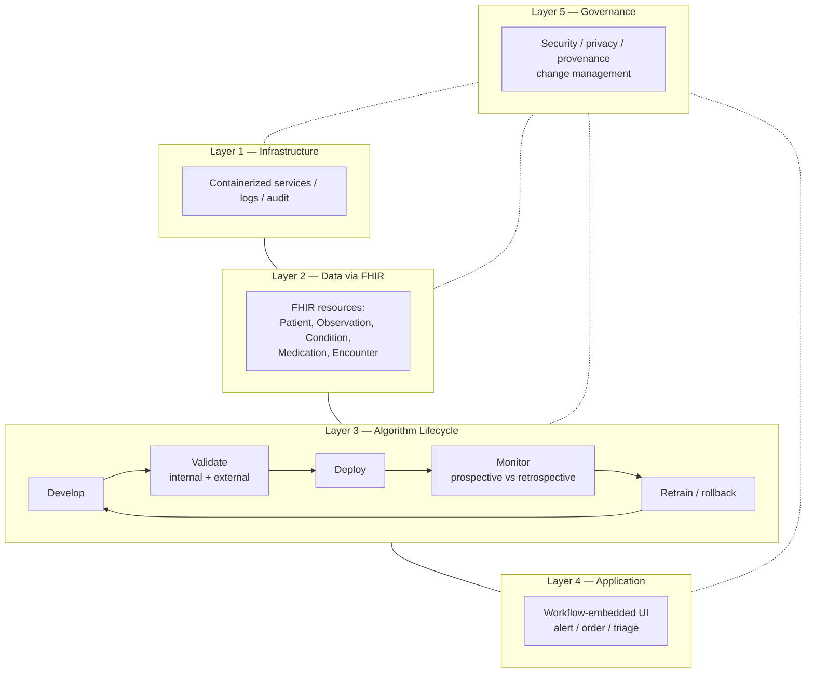

# Prototype P3 — Research-to-Practice Bridge Framework for Clinical AI

## Problem Statement

A working clinical AI model is not the same as a deployed clinical AI system. The research-to-practice gap — models that perform well in retrospective evaluation and collapse once they meet live clinical workflow — is now well documented. The gap shows up in several specific modes: interoperability friction, silent performance drift, alert fatigue, poor auditability, and unreviewed data leakage.

The prototype explores a reference framework — not a single model — that addresses this gap. The artifact is a set of interoperable architectural patterns a team can adopt when taking a clinical AI model from research into real hospital infrastructure.

## Motivation

Three drivers:

- **Documented failure modes from high-profile deployments.** The Epic Sepsis Model is now the canonical cautionary example. Retrospective AUC of 0.76–0.83; prospective sensitivity of 33% at one external site; alerts on 18% of inpatients while missing 67% of sepsis cases; alert fatigue; a data-leakage variable (antibiotic orders) not caught before wide deployment; delayed independent surveillance [1][2]. The lessons are architectural as much as statistical.
- **Interoperability standards are converging.** HL7 FHIR has crossed the usability threshold. Standardized resources (Patient, Observation, Condition, Medication, Encounter, DiagnosticReport) allow AI services to consume and emit clinical data without per-site custom adapters. Analyses have reported FHIR-based frameworks lifting data interoperability from ~11% to ~66% in real hospital contexts [3].
- **Regulatory guidance is maturing.** The FDA's Good Machine Learning Practice guidance, the CDER AI Council, and the draft guidance on AI for regulatory submissions together move the conversation from "can we build this model" to "how do we operate this system."

## Proposed Approach

The prototype is a five-layer reference architecture, adapted from recent systematic review on hospital AI platforms [4], with a lifecycle loop explicitly built in:

**Layer 1 — Infrastructure.** Compute, storage, network, deployment substrate. Containerized services, reproducible environments, audit-friendly logging.

**Layer 2 — Data (FHIR-based).** Standardized ingestion from EHRs and lab / imaging systems through FHIR resources. Mappings from native EHR tables (Epic, Cerner) into FHIR, plus multimodal integration for labs, notes, and device streams.

**Layer 3 — Algorithm lifecycle.** Not just training. Development → internal validation → external validation → deployment → continuous monitoring → re-training triggers. Explicit data-leakage audit as a mandatory step before deployment.

**Layer 4 — Application.** Workflow-embedded surfaces: alerts, order suggestions, triage scores. Designed with interface and alert-fatigue considerations first — integration, not inclusion, is the goal.

**Layer 5 — Security, compliance, governance.** Privacy (HIPAA), accountability (model provenance, audit logs), and governance (review cadence, change management, disclosure practices). Sits across all layers rather than bolted on at the end.

Crucially, the framework mandates a **prospective-to-retrospective performance gap monitor**. No deployment without a plan for ongoing comparison of prospective sensitivity / specificity / calibration against retrospective benchmarks, with defined thresholds for pausing or rolling back.

## Data & Infrastructure Requirements

- **A partner environment** with real FHIR endpoints (production or sandbox). Without this, the framework remains conceptual.
- **A model to deploy.** The framework is substrate — it assumes a model exists from other research, including but not limited to P1 or P2-style outputs.
- **Governance apparatus.** IRB, compliance, clinical leadership alignment. In real hospitals, this runs in parallel to the technical work and often determines timeline more than engineering.
- **Tooling.** FHIR servers (HAPI, SMART on FHIR, HealthLake); MLOps stack with model monitoring (Evidently, Seldon, WhyLabs, or equivalent); XAI layer (SHAP, LIME, counterfactual toolkits) as a first-class component, not a final-step decoration.

## Prototype Architecture Sketch

## Viability Considerations

Pursuing P3 as a real project would mean:

- **A hospital partner, committed.** Without access to a live FHIR environment and a clinical champion, the framework is a slide deck. With one, the engineering is substantial and the timelines are multi-year.
- **A larger team than P1 or P2.** Clinical informatics, MLOps, UX, compliance, security, clinical champions.
- **Sustained engagement.** The failure modes that motivate the framework are not solved at launch — they emerge over months of operation. The framework only does its job if someone operates it for long enough.

Within class-project scope, what is achievable is a *reference* version of the framework: the architectural patterns, a worked example of the lifecycle with a toy model, and a post-mortem of a documented failure case (e.g., the Epic Sepsis Model) interpreted through the framework's lens. A live hospital deployment is out of reach.

## Open Questions

- What is the right level of abstraction for the framework — generic enough to cover radiology, pathology, and sepsis alike, or specialized per clinical domain?
- How should the framework handle small-institution settings where in-house FHIR expertise does not exist?
- How does this framework map to clinical contexts *outside* the hospital — population-health surveillance, public-health dashboards, community-level health information systems? Does the same architectural posture transfer?

## References

1. Wong et al., "External Validation of a Widely Implemented Proprietary Sepsis Prediction Model in Hospitalized Patients" / follow-on work at the University of Michigan. See PMC and ATS Journals coverage, 2021–2023.
2. "Artificial Intelligence for Early Sepsis Detection: A Word of Caution," *American Journal of Respiratory and Critical Care Medicine*, 2023.
3. "Using FHIR and AI to Expand the Reach of Healthcare," vendor and analyst commentary, 2024–2025.
4. "Artificial Intelligence Platform Architecture for Hospital Systems: Systematic Review," *JMIR*, 2025.
5. U.S. FDA, "Good Machine Learning Practice for Medical Device Development: Guiding Principles," 2021; subsequent updates.
6. "Deploying Artificial Intelligence in Clinical Settings," *Artificial Intelligence in Health Care*, NCBI Bookshelf.
