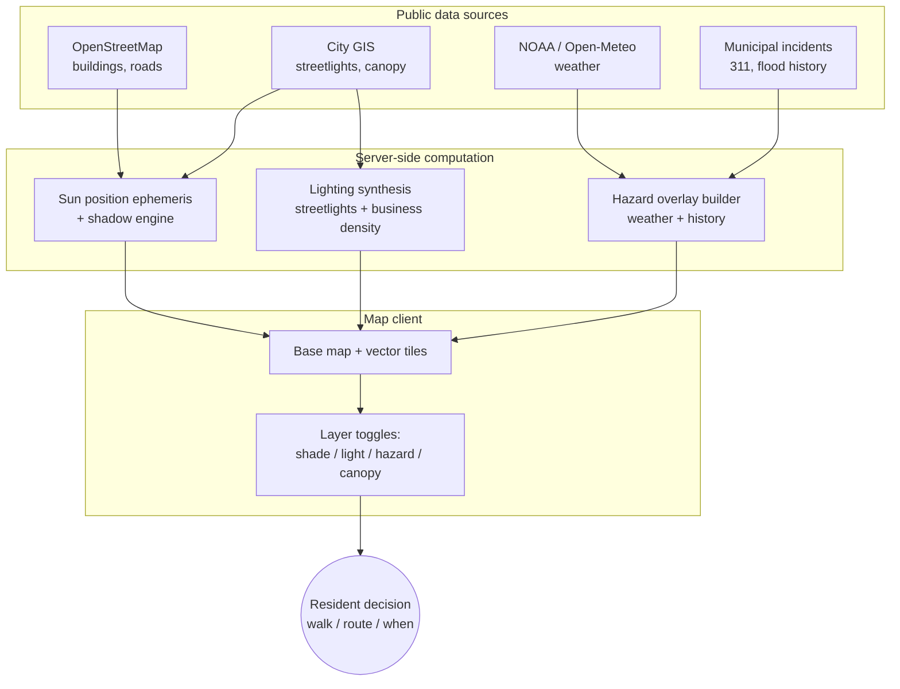

# Prototype P4 — Urban Environment Public Health Mapping

## Problem Statement

Most people's everyday health is shaped less by a clinical encounter than by the physical conditions of the place they live, work, and move through. Heat exposure, sun exposure, lighting at night, walkability, flood or ice hazards — these are measurable properties of streets, blocks, and buildings, and they produce measurable population-health signals. Yet the data behind them is scattered across municipal portals, federal agencies, and open geodatabases, and almost none of it is presented to the people whose decisions it could inform.

The prototype is a map-based public-health tool that integrates urban environmental data into a single spatial surface, addressed not to clinicians or epidemiologists but to the residents who move through the city every day.

## Motivation

- **Urban environment is a documented population-health input.** Neighborhood-scale variation in tree canopy and impervious surface coverage produces measurable differences in heat exposure and health outcomes; European work estimates ~40% of urban heat-island–related deaths could be prevented at a uniform 30% canopy cover [1]. Residential segregation is a strong predictor of canopy inequality in U.S. cities [2].
- **Boston and Cambridge are actively instrumenting this substrate.** Boston maintains a Heat Vulnerability Index and the "Right Place, Right Tree" planting tool; Cambridge runs a Back-of-Sidewalk program for private-land canopy expansion [3][4]. Public data pipelines exist; the gap is in citizen-facing synthesis.
- **Walkability and night-time safety are well-studied determinants.** Evidence links perceived pedestrian safety to informal surveillance, incivility, lighting, and sidewalk condition [5]. Night-time active travel is shaped by visibility and perceived risk, in ways that map directly to measurable infrastructure variables.
- **Preventive framing.** Unlike reactive disease surveillance, this tool targets the conditions that *precede* adverse events — heat exposure before heatstroke, dark streets before an incident, flood-prone paths before a fall. The preventive angle from the narrowing criteria is satisfied natively.

## Proposed Approach

The prototype is a web-based map that overlays multiple urban-environment layers on a common base map of Boston + Cambridge, each layer representing a population-health determinant at block / street granularity.

Four foundational layers:

**Daytime shade and sun exposure.** Building footprints (OpenStreetMap) + canopy cover (city GIS) + sun position (computed per-time-of-day) → a time-dependent shade field over the city surface. Surfaces heat-stress and UV-exposure risk for outdoor mobility.

**Night-time lighting and safety.** Streetlight locations (municipal open data) + active business density (licensing data) → a brightness field representing informal surveillance and visual safety at night. Complemented by sidewalk condition data where available.

**Weather hazard layer.** Live weather (NOAA / Open-Meteo) + historical flood-prone locations (municipal data / 311 reports) + freezing-condition icy-surface likelihood (weather + surface type) → transient hazard overlays.

**Tree canopy layer.** Canopy polygons + heat vulnerability index → visual context for the shade layer and a longer-time-scale signal about the distribution of preventive infrastructure.

Each layer answers a different question, but on the same map: *where is it safe to walk right now*, *where will it be hot*, *where will it be dark*, *where is flooding likely this afternoon*.

## Data & Infrastructure Requirements

- **Base geodata.** OpenStreetMap (buildings, roads, amenities), Boston Open Data, Cambridge Open Data.
- **Dynamic data.** NOAA / Open-Meteo weather APIs; sun position ephemeris (computed).
- **Static reference data.** Municipal streetlight and canopy layers, Heat Vulnerability Index, historical flood incident locations.
- **Compute.** Server-side shadow computation over building geometry; client-side map rendering (MapLibre GL JS or equivalent).
- **Stack.** Python (FastAPI or similar) for computation and API endpoints; a vector tile server for building footprints; a modern map client for overlays.

No gated data. No IRB. No clinical data use agreement. The feasibility profile is categorically different from P1–P3.

## Prototype Architecture Sketch

## Viability Considerations

The profile differs sharply from P1–P3:

- **No gated data.** All inputs are public. No IRB, no institutional DUA, no federated-query infrastructure.
- **Single-semester feasible.** A working prototype with the four foundational layers is buildable by a small team in a semester, including public web deployment.
- **Boston + Cambridge anchored by construction.** The spatial scope is the course's scope.
- **Intuitive by design.** A map is, categorically, a surface a non-specialist can read. Residents can look at their neighborhood and extract information without training.
- **Preventive by design.** Every layer is a property of the environment *before* an adverse event.

## Implicit Continuity with Prior Prototypes

Although this prototype sits on a different substrate from P1–P3, the five architectural commitments from the synthesis carry through directly, by construction rather than by force:

- **Integration of heterogeneous data** — buildings, lights, weather, canopy, incident history, on one surface.
- **Support for decisions made by humans** — resident-level everyday spatial decisions.
- **Deployability** — a public web application is the deployment target, not a hypothetical hospital integration.
- **Safety and personalization** — routes and exposures differ by person, time, and weather.
- **Scale** — the city, rather than a single clinic or a single patient.

The substrate has shifted — from patient records to place-based data, from clinician to resident, from hospital to city — but the architectural discipline remains the same.

## Open Questions

- Which layers are most decision-relevant? The foundational four cover substantial ground, but the prioritization is empirical.
- How are layers combined visually without overwhelming the map? Default overlay, single-at-a-time, or contextual switching?
- What time windows matter most — real-time current conditions, next-few-hours outlook, historical patterns?
- How is this evaluated? No clinical endpoint applies; the measure has to be something like decision-relevance or perceived usefulness to residents.

The next document evaluates this concept against the narrowing criteria and proposes it as the class project direction.

## References

1. "Cooling Benefits of Urban Tree Canopy: A Systematic Review," *Sustainability*, 2024.
2. "Residential housing segregation and urban tree canopy in 37 US Cities," *npj Urban Sustainability*, 2021.
3. Speak for the Trees Boston, "Tree Equity Maps" and Boston Heat Vulnerability Index.
4. "Wicked Hot Boston: Urban Heat Island Mapping," SciStarter, 2019.
5. "The influence of the built environment on pedestrians' perceptions of attractiveness, safety and security," *ScienceDirect*, 2022.
6. CDC, "Neighborhood and Built Environment" (Healthy People 2030 framework).
